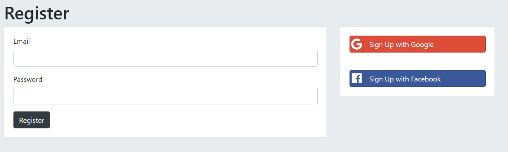
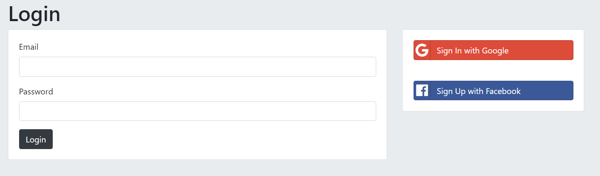
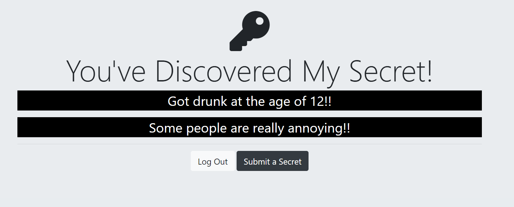
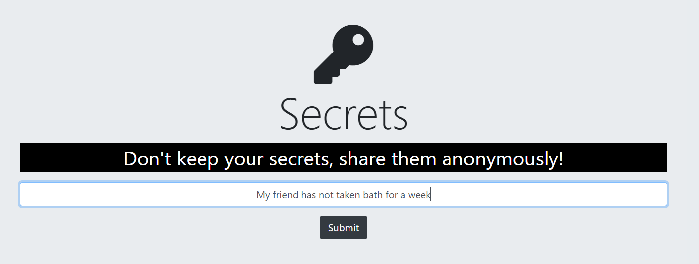
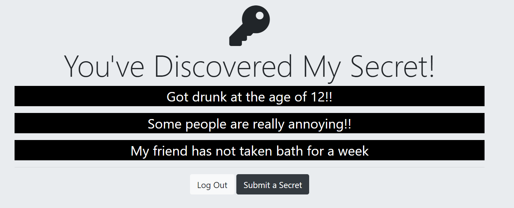

# Secrets
🤐 An app where a user can sign up and write messages anonymously.

# Idea
* Many people today want to comment something or say something online without revealing their identity
* Secrets app is an initiative where people can post about anything anonynously
* Users can also see other people's comments which are anonymous as well

# Technologies
* Used HTML5, CSS3, Bootstrap and JavaScript to develop the front-end
* Node.js and Express.js to create server and develop back-end
* Used MongoDB (Mongoose) as the database
* EJS as the template engine
* Used Passport.js to implement third party OAuth2 to authorize the users using Google and Facebook

# Prerequisite
* Download, install and setup Node.js
* Download, install and setup MongoDB and Robo3T
* Install Nodemon (optional)

# Setup
* User needs to Clone the repo using git clone to their local repo
* Now, open gitbash or any other terminal and navigate to the project folder
* Next step is to install the node modules using the command `npm install` 
* When the modules are installed, type `node app.js`. User can also type `nodemon app.js` if they have nodemon installed
* Running the command will set up our server and the user can see the message - "Server has started running successfully"

# Getting Started
* Now, user needs to open the browser and go to `localhost:3000` to open the website
* User can now follow the prompts on the website to register and login on the app. User can also login using there Google or Facebook id
* When user is logged in, the user can see all the post. They can also click on **Submit a Secret** button which will redirect them to the next page
* On the next page, user can type their secret and and click on **submit** button to post their Secret on the main page.
* A user can also logout from the app when the message has been posted

# Screenshots

* **Register Page**

* **Login Page**

* **Page when a user log in**

* **Page where a user can type a secret**

* **User posts a secret**

